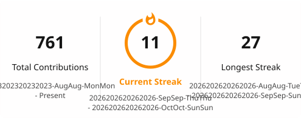

<h1 align="center">Hi there, I'm Kevin 👋</h1>

  

  
  

  I make random coding projects — mostly <b>automation</b> tools and <b>file viewers</b>.
  I like small focused utilities that do one job well, and web apps that work everywhere.

---

## 📊 GitHub Stats

  <picture>
    <source media="(prefers-color-scheme: dark)" srcset="./assets/stats-dark.svg">
    
  </picture>

  <picture>
    <source media="(prefers-color-scheme: dark)" srcset="./assets/streak-dark.svg">
    
  </picture>

  <picture>
    <source media="(prefers-color-scheme: dark)" srcset="./assets/top-langs-dark.svg">
    
  </picture>

---

## 🌟 Featured Projects

<table>
  <tr>
    <td width="50%" valign="top">
      <picture>
        <source media="(prefers-color-scheme: dark)" srcset="https://github-stats-extended.vercel.app/api/pin/?username=Chickenman67&repo=video-player&theme=github_dark_repocard">
        
      </picture>
    </td>
    <td width="50%" valign="top">
      <picture>
        <source media="(prefers-color-scheme: dark)" srcset="https://github-stats-extended.vercel.app/api/pin/?username=Chickenman67&repo=marginalia&theme=github_dark_repocard">
        
      </picture>
    </td>
  </tr>
  <tr>
    <td valign="top">
      <picture>
        <source media="(prefers-color-scheme: dark)" srcset="https://github-stats-extended.vercel.app/api/pin/?username=Chickenman67&repo=KnowYourClassAction&theme=github_dark_repocard">
        
      </picture>
    </td>
    <td valign="top">
      <picture>
        <source media="(prefers-color-scheme: dark)" srcset="https://github-stats-extended.vercel.app/api/pin/?username=Chickenman67&repo=ScholarScraper&theme=github_dark_repocard">
        
      </picture>
    </td>
  </tr>
  <tr>
    <td valign="top">
      <picture>
        <source media="(prefers-color-scheme: dark)" srcset="https://github-stats-extended.vercel.app/api/pin/?username=Chickenman67&repo=AI-Writer&theme=github_dark_repocard">
        
      </picture>
    </td>
    <td valign="top">
      <picture>
        <source media="(prefers-color-scheme: dark)" srcset="https://github-stats-extended.vercel.app/api/pin/?username=Chickenman67&repo=cbz-viewer-v3&theme=github_dark_repocard">
        
      </picture>
    </td>
  </tr>
</table>

---

## 🆕 Recently Worked On

<!-- This section is rebuilt automatically every day by GitHub Actions. -->
<!-- Anything you write between the markers will be overwritten.          -->
<!-- AUTO:RECENT:START -->

| Project | Description | Language | Last commit |
| :--- | :-- | :-- | --: |
| **[Paint](https://github.com/Chickenman67/Paint)** | Lets run the gauntlet | — | 2026-10-04 |
| **[video-player-ez](https://github.com/Chickenman67/video-player-ez)** | _No description yet._ | HTML | 2026-09-16 |
| **[test](https://github.com/Chickenman67/test)** | _No description yet._ | HTML | 2026-08-19 |

<!-- AUTO:RECENT:END -->

---

## 🛠️ Built With

`Python` · `JavaScript` · `TypeScript` · `HTML` · `CSS` · `Git`

---

## 🔧 How this profile stays up to date

Everything above the *Recently Worked On* table is regenerated automatically by
[GitHub Actions](https://github.com/Chickenman67/Chickenman67/actions) — no PC,
laptop, or browser needs to be switched on.

| Piece | What it does |
| :--- | :-- |
| [`profile-cards.yml`](.github/workflows/profile-cards.yml) | Runs daily, builds the cards, commits the result |
| [`recent-projects.mjs`](.github/scripts/recent-projects.mjs) | Finds newly active repos and rewrites the table above |
| [`assets/`](assets) | The generated SVGs, committed so the profile renders without any third-party service |

Cards are drawn from
[GitHub Stats Extended](https://github.com/stats-organization/github-stats-extended)
(the maintained successor to the now-archived `github-readme-stats`) and
[github-readme-streak-stats](https://github.com/DenverCoder1/github-readme-streak-stats).

The header animation is [readme-typing-svg](https://github.com/DenverCoder1/readme-typing-svg),
and the tech icons are [skillicons.dev](https://skillicons.dev).

---

  Made with ☕ and too much free time.

