

  <!-- Hero banner, generated locally by .github/scripts/cards.mjs -->
  

  

  I make small, focused tools — mostly <b>automation scripts</b> and <b>file viewers</b> —
  plus the occasional web app I wished already existed.
  Everything below rebuilds itself every night while I sleep.

---

## 🐍 The Snake

  <picture>
    <source media="(prefers-color-scheme: dark)" srcset="./assets/snake-dark.svg">
    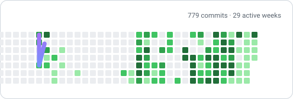
  </picture>

---

## 📊 Stats

  <picture>
    <source media="(prefers-color-scheme: dark)" srcset="./assets/stats-dark.svg">
    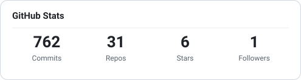
  </picture>

  <picture>
    <source media="(prefers-color-scheme: dark)" srcset="./assets/top-langs-dark.svg">
    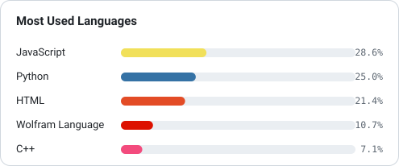
  </picture>

## 🗓️ Year in Review

  <picture>
    <source media="(prefers-color-scheme: dark)" srcset="./assets/activity-dark.svg">
    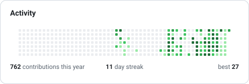
  </picture>

## 🚧 Recently Worked On

<!-- Rebuilt every day by GitHub Actions. Anything between the two markers
     below is overwritten on each run; edit outside them freely. -->

<!-- AUTO:PROJECTS:START -->

<table>
<tr>
  <td valign="top" width="50%">
    <a href="https://github.com/Chickenman67/Paint">
      <picture>
        <source media="(prefers-color-scheme: dark)" srcset="./assets/project-dark-1.svg">
        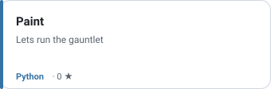
      </picture>
    </a>
  </td>
  <td valign="top" width="50%">
    <a href="https://github.com/Chickenman67/GodEngine">
      <picture>
        <source media="(prefers-color-scheme: dark)" srcset="./assets/project-dark-2.svg">
        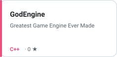
      </picture>
    </a>
  </td>
</tr>
<tr>
  <td valign="top" width="50%">
    <a href="https://github.com/Chickenman67/OperaGX-Spoofer">
      <picture>
        <source media="(prefers-color-scheme: dark)" srcset="./assets/project-dark-3.svg">
        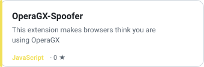
      </picture>
    </a>
  </td>
  <td valign="top" width="50%">
    <a href="https://github.com/Chickenman67/AutoSerach">
      <picture>
        <source media="(prefers-color-scheme: dark)" srcset="./assets/project-dark-4.svg">
        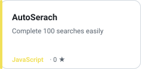
      </picture>
    </a>
  </td>
</tr>
<tr>
  <td valign="top" width="50%">
    <a href="https://github.com/Chickenman67/CBZ-Viewer-Optimized">
      <picture>
        <source media="(prefers-color-scheme: dark)" srcset="./assets/project-dark-5.svg">
        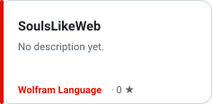
      </picture>
    </a>
  </td>
  <td valign="top" width="50%">
    <a href="https://github.com/Chickenman67/CBZ-Viewer">
      <picture>
        <source media="(prefers-color-scheme: dark)" srcset="./assets/project-dark-6.svg">
        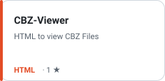
      </picture>
    </a>
  </td>
</tr>
</table>

<!-- AUTO:PROJECTS:END -->

## 🧩 What I build

<table>
<tr>
<td valign="top" width="50%">
  <b>⚙️ Automation</b>  
  Scripts and pipelines that take the repetitive work off my hands — scrapers, schedulers, and bots that keep running on their own.
</td>
<td valign="top" width="50%">
  <b>📂 File viewers</b>  
  Browser-based readers, so a file can be opened from anywhere without installing anything first.
</td>
</tr>
<tr>
<td valign="top">
  <b>🌐 Web apps</b>  
  Small single-purpose tools that live in a tab and simply work.
</td>
<td valign="top">
  <b>🤖 Experiments</b>  
  Weekend projects. Half of them stay unfinished, which is rather the point.
</td>
</tr>
</table>

---

  🐍 The snake is eating my last 12 months of commits.

